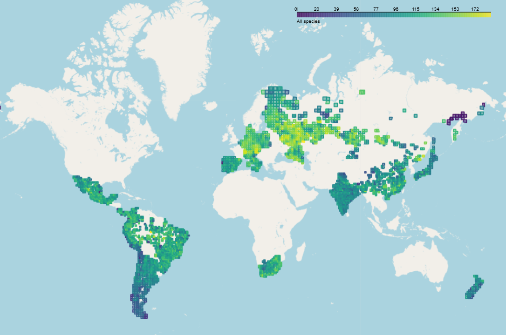
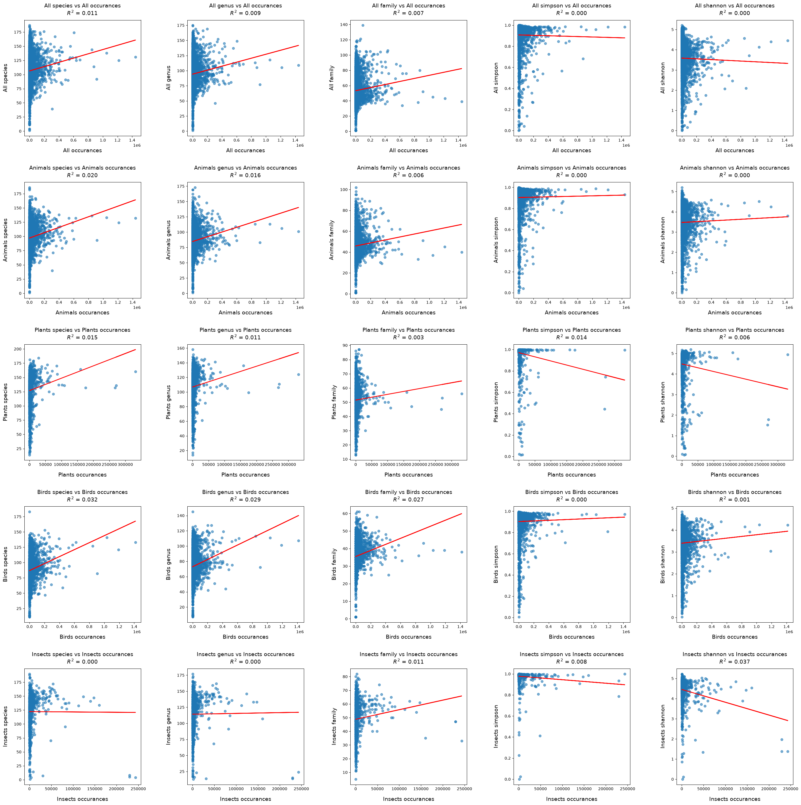
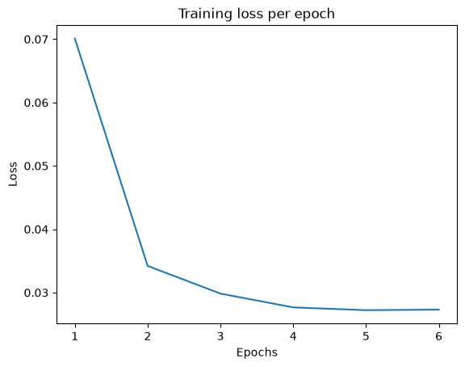
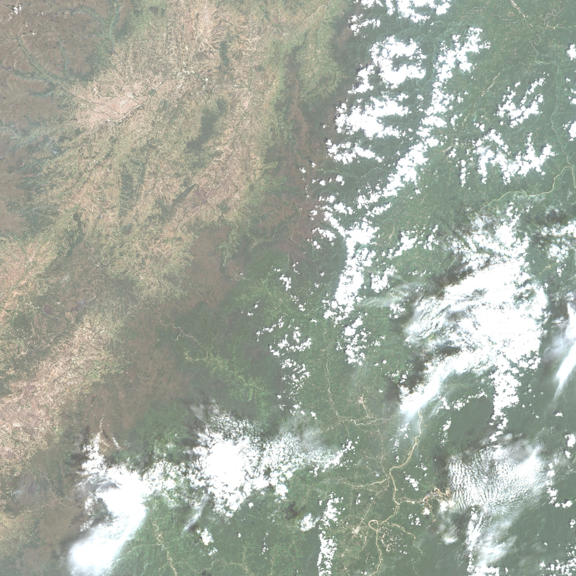

# Introduction
This project aims to create a neural network model capable of predicting biodiversity levels based on satellite imagery. Satellite imagery is taken from Sentinel-2 via the Copernicus Data Space Ecosystem. Biodiversity data is taken from the Global Biodiveristy Information Faciity. 

A full written report on this project is available on request, which provides more details on methodology and discussion of results. 

This repository is comprised of 5 code files, as well as some supporting files and some output files. Here is a summary of the repository contents.

## Code files:
* **Gather_GBIF_Sentinel_data.py** - This is the data gathering script that calls the CDSE and GBIF APIs to assemble the dataset used for model training. 
* **Data exploration.ipynb** - This notebook contains the analysis and visualisations used to analyse and explore the dataset resulting from the prior script. These visualisations appear in the 'Data Exploration' section of the report. 
* **Build_EfficientNet_Attention_MLP_model.py** - This script is used to compile and train the final neural network used in the report, based on the dataset gathered by the prior script. 
* **Build_Simple_CNN_MLP_model.py** - This script was used to compile and train a simpler, earlier version of the neural network model, that ultilately proved unsuccessful. Results for this neural network are included in the report for comparison. 
* **Model_visualisation.py** - This notebook is used to analyse the model - it creates charts visualising the training process, conducts forward passes of the model to make predictions, and uses the model's attention mechanism to infer which features the model has learned. These visualisations appear in the 'Model exploration' section of the report. 

## Other files:
* **Dockerfile** - This is the dockerfile used to build the container for the Gather_GBIF_Sentinel_data.py script. 
* **EfficientNet_Attention_MLP_weights.h5** - These are the weights of the final EfficientNetB0-Attention-MLP model after training. They are used to reconstruct the model in the Model visualisation.ipynb notebook. 
* **EfficientNet_final_training_history_All_shannon.json** - This is the training history log of the final EfficientNetB0-Attention-MLP model. It is used in the Model visualisation.ipynb notebook. 
* **GBIF_data_output final.csv** - This is the GBIF biodiversity dataset that results from running the Gather_GBIF_Sentinel_Data.py script. It is used by the scripts that train the models, and in the model visualisation.ipynb notebook. The other crucial data that results from the data gathering script are the jpeg images from Sentinel-2, but these are too large to add to the repository. 
* **requirements.txt** - These are the package requirements used to build the docker image for the Gather_GBIF_Sentinel_data.py script. 

The rest of this page will cover how to run each of the code files. 

# Gather_GBIF_Sentinel_data.py

This script gathers the dataset used to train the neural network model. It has two outputs: 
* A csv file containing biodiversity metrics for each area tile (a copy of this csv file is available in this repository - GBIF_data_output final.csv)
* A directory containing Sentinel-2 jpeg images for each area tile, with filenames corresponding to tile names. 

The script will save over 3,600 10k x 10k pixel images, and so a lot of storage is required. For this reason the script was run on a SLURM cluster, made available via Birkbeck University.

In order to run the script, you will need to create accounts for CDSE (see https://documentation.dataspace.copernicus.eu/Registration.html) and GBIF (see https://www.gbif.org/user/register). The script expects credentials for these services to be available as environment variables during runtime. CDSE credentials should be saved as variables called "ACCESS_KEY" and "SECRET_KEY", while GBIF crederntials should be saved to variables called "GBIF_USERNAME", "GBIF_EMAIL" and "GBIF_PASSWORD". If running on SLURM, this can be done using the sbatch file that calls the script. 

In order to run, you will also need to download a copy of the kml file containing coordinates for the Military Grid Reference System (MGRS) used by Sentinel-2 for its tiling grid. This can be downloaded from https://sentiwiki.copernicus.eu/web/s2-documents, look for the file called 
S2A_OPER_GIP_TILPAR_MPC__20151209T095117_V20150622T000000_21000101T000000_B00.zip. Extract the kml file, save it in the same working directory as the script, and ensure it is called S2A_OPER_GIP_TILPAR_MPC__20151209T095117_V20150622T000000_21000101T000000_B00.kml.

The script works with a directory structure that has a directory called 'data'. and then within that a folder called 'GBIF_downloads' (for temporarily storing country files downloaded from GBIF), one called 'GBIF_tile_files_saved' (for saving GBIF data for a set number of specific tiles for further exploration), one called 'j2_files' (for temporarily storing j2 files from CDSE for individual light bands of each image), one called 'jpeg_files' (for storing the final Sentinel-2 images) and one called 'Outputs' (for storing the final biodiversity data csv file). If these directories do not already exist in the current working directory, the script will make them.

The script can be deployed to be run on a SLURM cluster, or other GPU cluster, using a docker container. A Dockerfile and requirements file are provided in this repository for creating a docker image. Alternatively, a ready-made docker image is available here: https://hub.docker.com/repository/docker/tobygill95/gather_gbif_sentinel_data/general. 
Using this image will also prevent issues arising from package version conflicts. 

# Data exploration.ipynb
In order to run, this notebook must be in the same working directory as the biodiversity data csv file outputted by the previous script (called 'GBIF_data_output final.csv' in this repository). Additionally, the kml file for the MGRS tile boundaries, mentioned in the previous section, will need to be in the same working directory, with the same file name as mentioned above. 

The notebook doesn't save any outputs as files - all the necessary visualisations are shown in results on screen. 

# Build_EfficientNet_Attention_MLP_model.py
This script is used for model training, based on the training dataset compiled by the first script.

The script has three outputs - an h5 file containing the weights of the trained model (called EfficientNet_Attention_MLP_weights.h5 in this repository), a json file containing the training history of the model (called 'EfficientNet_final_training_history_All_shannon.json in this respository) and a csv file cotaining a summary of the model's performance against the test set, in comparison to a naive estimator and a simple linear regression model. 

In order to run, this script must be in the same working directory as the biodiversity data csv file outputted by the first script (called 'GBIF_data_output final.csv' in this repository) a directory of Sentinel-2 images outputted by the first script, called 'jpeg_files'. 

All outputs for this script are saved to a directory called 'Model_outputs', that must exist within the working directory for the script to run.

Parameters for training can be set using variables at the top of the script, after the required packages have been imported. Batch size, patches per image, epochs and dropout rate can be customised (set at 1, 500, 200, 20 and 0.2 respectively during the project). If model_save is set to True, then the script will save the weights of the model to the Model_outputs directory after training. 

As the script trains a neural network, GPU compute is necessary. The script is therefore intended to be run on a SLURM cluster, but can be tested locally. If run_locally is set to False, then outputs will be directed to a 'run.log' file within the Model_outputs directory, rather than just printed to terminal. Additionally, the number of images included in training can be modified using the dataset_size_limit variable (allowing the script to be tested locally on one or two images). If this is set to None, then all images are included. 

The script is designed so that the model can be trained on any number of the potential target variables included in the GBIF data file. Any other variables that you would like the model to be trained on can be added to the target_variables list, and the script will recurse through all of them, recording the training and testing results for each. 

There is no docker image for this script, so ensure that whatever environment is used to run the script has keras and tensorflow installed. 

# Build_Simple_CNN_MLP_model.py
This script is an earlier version of the same model training script described above - is has all the same requirements in order to be run, and the same parameters can be adjusted in variables near the top of the script. 

# Model visualisation.ipynb
This notebook is used to create visualisations for exploring the EfficientNetB0-Attention_MLP model trained by the previous script. 

In order to run, it must be in the same working directory as the weights of the trained model (called EfficientNet_Attention_MLP_weights.h5 in this repository), the json file containing the training history of the model (called 'EfficientNet_final_training_history_All_shannon.json in this respository) and the csv file of the GBIF biodiversity dataset (called 'GBIF_data_output final.csv' in this repository). 

The first few cells in the notebook plot charts using the training history of the model. The latter half of the notebook is dedicated to running forward passes of the model, in order to make predictions for specific images, and to see which patches are given most attention weighting by the model in order to infer which features it has identified. 

The notebook is constructed so that running all the cells will run one forward pass for one image. In the first cell of the forward pass section, in variables under the comment 'Choose an input image and image directory path', you can choose which image the forward pass is done on, and which directory that image is saved within. The subsequent cell will print the actual value and predicted value for the All-organism Shannon index for the image. The final cells of the notebook then display the three image patches given the highest attention weight and the three given the lowest. 

This notebook is intended to be run locally. Issues with tensorflow's Time Distributed function poorly utilising the local CPU meant that the model has to be manually run over the 500 image patches using a for loop. 

